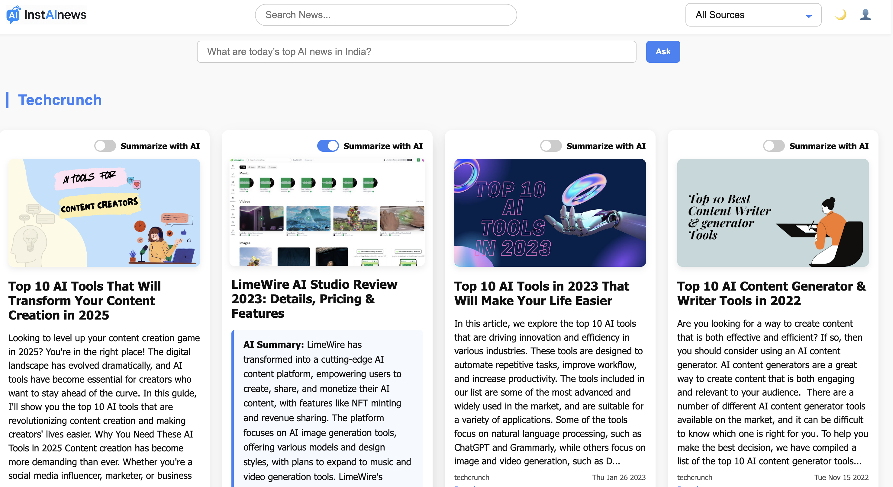

## 🚀 Live Demo  
🌐 [https://inst-a-inews.vercel.app/]

---
# instAInews
InstAInews is an intelligent news aggregator web application that curates news from multiple Indian and global sources, enriched with AI-powered features like summarization and conversational search.
Built with React, Node.js, RSS feeds, and OpenAI, InstAInews delivers a modern, interactive, and insightful way to stay updated.

⸻

### 🔹 Dashboard  
Manage your blog posts from a sleek, minimal interface.

---

✨ Features

✅ News Aggregation
Fetches latest headlines from curated RSS feeds like NDTV, Indian Express, TechCrunch, HackerNews, and more.

✅ Dark/Light Mode
Switch between sleek dark and clean light themes using the toggle.

✅ Source Filtering
Dropdown to view news from a specific publisher.

✅ Search
Instantly filter news by keyword using the search bar.

✅ AI Summarization
Toggle to convert long news snippets into crisp, AI-generated summaries using OpenAI’s GPT.

✅ Ask AI About the News
Conversational interface to ask questions like “What are today’s top AI headlines in India?” and get a natural language response based on the latest news.

✅ Responsive Design
Optimized for mobile, tablet, and desktop viewing.

⸻

🛠️ Tech Stack
	•	Frontend: React, CSS Modules
	•	Backend: Node.js, Express
	•	AI: OpenAI GPT-3.5
	•	Feeds: RSS Parser, Multiple Indian/Global RSS sources

⸻

 Future Ideas
	•	Bookmarking articles
	•	Personalized digests via email
	•	Multilingual summaries (Hindi/Regional)
	•	Trending keyword visualization
